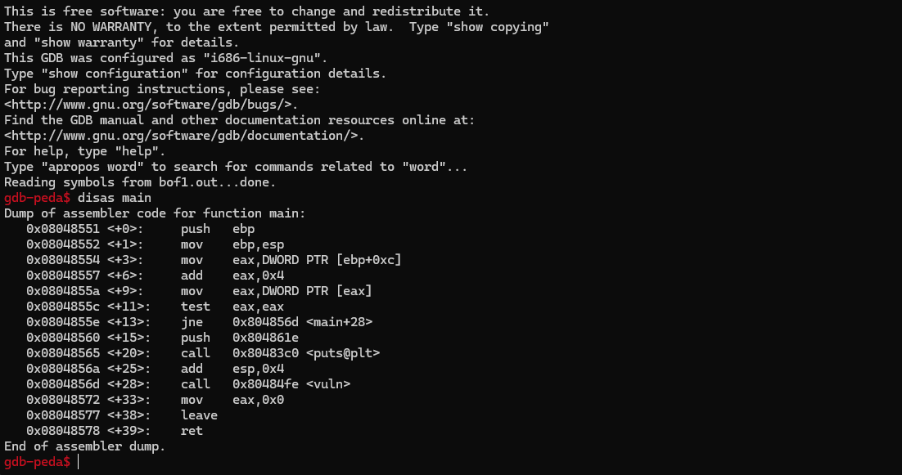
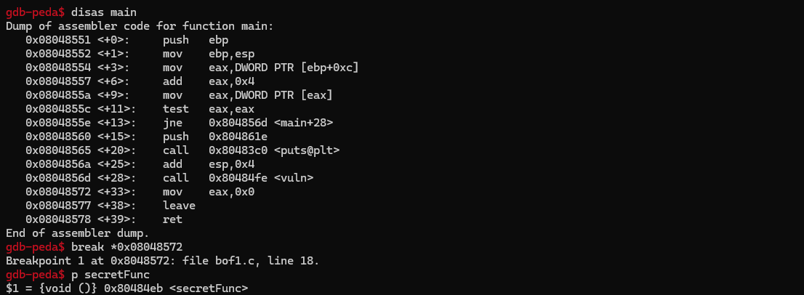
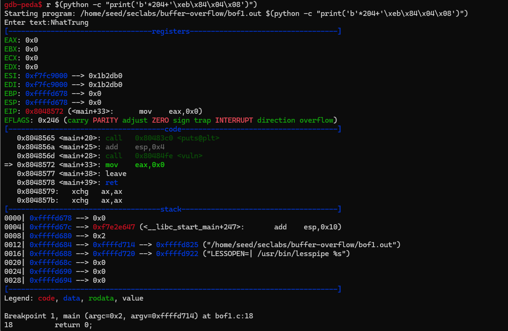
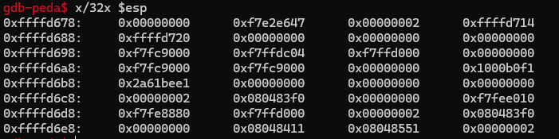

# REPORT LAB

| Student ID | Full Name |
| :--- | :--- |
| 21110807 | Lý Nguyễn Nhật Trung |

___Lab#1:___ Conduct buffer overflow attack on bof1.c, bof2.c, bof3.c programs

| Labs | Explanation |
| :---| :--- |
| bof1.c |  Chúng ta có một mảng 200 byte trong stack. Để thực thi secretFunc, ta sẽ đưa địa chỉ của nó vào vị trí địa chỉ trả về (eip). Bằng cách này, chương trình sẽ bị tràn bộ đệm, và ta có thể thêm địa chỉ của secretFunc vào địa chỉ trả về (eip) khi chọn 204 byte. Đặt một điểm dừng ngay sau khi hàm vuln() trong main, sau đó kiểm tra địa chỉ của secretFunc.   Đọc thanh ghi esp, không có 'b' trong bộ nhớ.  | 
